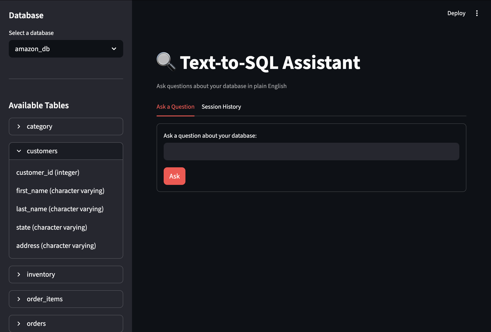
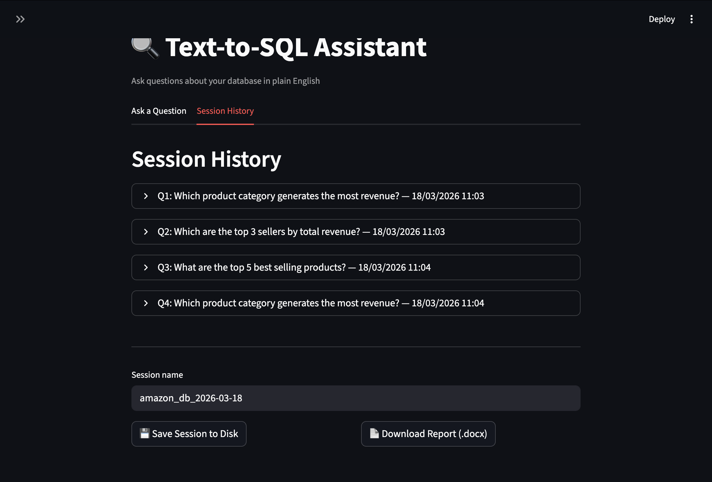
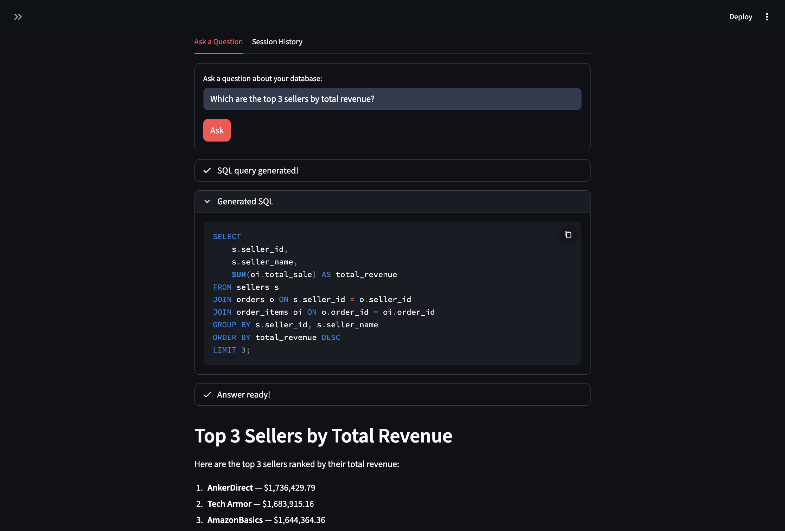

# 🔍 Text-to-SQL Assistant

## Overview
Text-to-SQL Assistant bridges the gap between business questions and database insights. Instead of writing SQL manually, you ask questions in plain English — the assistant handles query generation, execution, and interpretation automatically.

Built on top of **Claude AI (Anthropic)** and **PostgreSQL**, it comes with both a **Streamlit web interface** for non-technical users and a **command-line script** for terminal workflows.



---

## The Problem It Solves
Most data lives in databases that require SQL knowledge to query. This tool removes that barrier entirely:

- A business analyst can ask *"Which product category generated the most revenue last quarter?"* without writing a single line of SQL
- A data team can use it to explore unfamiliar databases quickly
- Anyone can export structured session reports for sharing or documentation

---

## How It Works
```
User asks a question in plain English
            ↓
Claude reads the database schema automatically
            ↓
Claude generates a precise PostgreSQL query
            ↓
Query is executed on the connected database
            ↓
Claude interprets the raw results into a clear answer
            ↓
Session saved as .json + .docx report
```

---

## Query in Action

Ask a question in plain English and get a structured answer in seconds — with the generated SQL visible for full transparency.



**Example:**

**Question:** *Which are the top 3 sellers by total revenue?*

**Generated SQL:**
```sql
SELECT s.seller_id, s.seller_name, SUM(oi.total_sale) AS total_revenue
FROM sellers s
JOIN orders o ON s.seller_id = o.seller_id
JOIN order_items oi ON o.order_id = oi.order_id
GROUP BY s.seller_id, s.seller_name
ORDER BY total_revenue DESC
LIMIT 3;
```

**Answer:**
> 1. AnkerDirect — $1,736,429.79
> 2. Tech Armor — $1,683,915.16
> 3. AmazonBasics — $1,644,364.36

---

## Session History & Export

Every question, query, and answer is stored in the session history tab. At the end of your session you can download a formatted `.docx` report or save everything to disk as `.json` + `.docx`.



---

## Features

**Core functionality**
- Natural language → SQL translation via Claude AI
- Automatic schema discovery across all tables and columns
- Multi-database support — switch between databases from the sidebar
- Collapsible schema explorer in the sidebar
- Error handling for invalid or failing SQL queries — no crashes

**Session management**
- Full session history with questions, generated queries, and answers
- Export session as a formatted `.docx` report
- Direct browser download or save to disk
- JSON export for pipeline integration or further analysis

**Two interfaces**
- Streamlit web UI — clean browser-based experience for non-technical users
- Command-line interface — lightweight terminal workflow for developers

---

## Tech Stack

| Component | Technology |
|---|---|
| AI Model | Anthropic Claude (`claude-sonnet-4-6`) |
| Web Interface | Streamlit |
| Database | PostgreSQL via psycopg2 |
| Report Generation | python-docx + html2docx |
| Markdown Conversion | markdown library |
| Credential Management | python-dotenv |
| Language | Python 3.12 |

---

## Setup

**1. Clone the repository**
```bash
git clone https://github.com/EdoChiari/Text-to-SQL-Assistant.git
cd Text-to-SQL-Assistant
```

**2. Create a virtual environment**
```bash
python3 -m venv .venv
source .venv/bin/activate
```

**3. Install dependencies**
```bash
pip install anthropic psycopg2-binary python-dotenv python-docx streamlit markdown html2docx watchdog
```

**4. Configure credentials**

Create a `.env` file in the project root:
```
ANTHROPIC_API_KEY=your-anthropic-api-key
DB_HOST=localhost
DB_PORT=5432
DB_NAME=your-database-name
DB_USER=your-username
DB_PASSWORD=your-password
```

---

## Running the App

### Web interface (recommended)
```bash
streamlit run app.py
```
Opens at `http://localhost:8501` with the full UI — database selector, collapsible schema explorer, question input, session history tab, and report export.

### Command-line interface
```bash
python script.py
```
Interactive terminal session. Type `exit` to end and save the session.

---

## Output Structure

Each session is saved in a dedicated folder:
```
📁 session_name/
    ├── session_name.json    ← structured data (database, date, all Q&A)
    └── session_name.docx    ← formatted report ready to share
```

---

## Roadmap
- [x] Natural language to SQL translation
- [x] Automatic schema discovery
- [x] Multi-database support
- [x] Error handling for invalid queries
- [x] Session export as .docx and .json
- [x] Streamlit web interface
- [x] Direct browser download for reports
- [x] Query history
